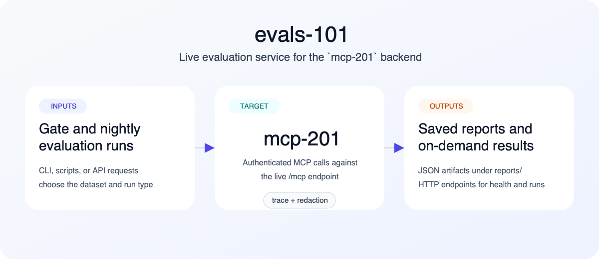

# evals-101



`evals-101` evaluates the live `mcp-201` backend over its MCP HTTP endpoint. It runs deterministic gate suites for routing and security regressions, then optionally runs broader `DeepEval` nightly grading on the same live outputs.

## Why `evals_101` exists inside `evals-101`

The repo name is `evals-101` because that is a readable project name. Python packages cannot use hyphens, so the importable module is `evals_101`.

## What this repo does

- calls the real `mcp-201` MCP server at `/mcp`
- preserves deterministic gate coverage for routing, tool sequencing, output counts, and secret-handling regressions
- stores JSON reports for both gate and nightly runs
- exposes a small HTTP service for on-demand runs and report lookup

## Evaluation model

`evals-101` uses two layers:

1. Gate evals: deterministic assertions that should never be flaky.
2. Nightly evals: broader rubric-based scoring using `DeepEval`.

This hybrid model is intentional:

- deterministic gate runs remain custom because contract checks and security regressions must stay exact
- nightly scoring uses `DeepEval`, which is the mainstream eval package integrated into this repo

## Repository layout

- `docs/agent-handoff.md`: end-to-end overview for a new agent continuing deployment or extension work
- `docs/mcp-201-baseline.md`: extracted contract and security baseline from `mcp-201`
- `datasets/gate/`: deterministic datasets for CI and release checks
- `datasets/nightly/`: broader prompts for nightly judge-model scoring
- `evals_101/mcp_client.py`: authenticated MCP client for the live `mcp-201` backend
- `evals_101/graders.py`: deterministic grading utilities
- `evals_101/run_manager.py`: shared gate/nightly execution and report persistence
- `evals_101/cli.py`: deterministic gate entrypoint
- `evals_101/deepeval_runner.py`: `DeepEval` nightly entrypoint
- `evals_101/api.py`: HTTP trigger/read service for Railway and local use
- `scripts/setup_local.sh`: local environment bootstrap
- `scripts/run_gate.sh`: deterministic gate suite wrapper
- `scripts/run_nightly.sh`: nightly suite wrapper
- `scripts/run_service.sh`: local HTTP service wrapper
- `scripts/run_tests.sh`: unit-test wrapper
- `scripts/deploy_docker.sh`: build the local container image

## Prerequisites

- Python 3.11+
- `pip`
- a reachable `mcp-201` backend

## Environment variables

- `MCP_201_BASE_URL`: target MCP endpoint, default `http://localhost:8010/mcp`
- `MCP_201_AUTH_TOKEN`: bearer token for secured `mcp-201` deployments
- `EVALS_101_REPORTS_DIR`: report output directory, default `reports`
- `OPENAI_API_KEY` or `ANTHROPIC_API_KEY`: required for nightly `DeepEval` runs
- `EVALS_101_REQUIRE_API_AUTH`: set to `true` to require auth on the eval service
- `EVALS_101_API_AUTH_TOKEN`: bearer token for the eval service when API auth is enabled
- `EVALS_101_API_PORT`: local/API service port, default `8020`

## Local setup

```bash
./scripts/setup_local.sh
```

This creates a local `.venv` and installs the repo in editable mode.

## Run locally

Run the deterministic gate suite:

```bash
./scripts/run_gate.sh
```

Run the nightly suite:

```bash
./scripts/run_nightly.sh
```

Run the on-demand service:

```bash
./scripts/run_service.sh
```

Run unit tests:

```bash
./scripts/run_tests.sh
```

## Reports

Gate and nightly runs both persist JSON reports under `reports/gate/` or `reports/nightly/` unless you override `--output`.

Example gate run:

```bash
. .venv/bin/activate
python -m evals_101.cli \
  --dataset datasets/gate/workflow_routing.json \
  --system mcp-201
```

Example nightly run:

```bash
. .venv/bin/activate
python -m evals_101.deepeval_runner \
  --dataset datasets/nightly/tool_use.json \
  --system mcp-201
```

Each report includes:

- run metadata such as `run_id`, timestamp, target URL, and dataset
- summary counts for passed cases and security checks
- per-case expected input, actual live result, and grading details
- nightly judge scores and reasons when using `DeepEval`

## HTTP service

The service exposes:

- `GET /`
- `GET /healthz`
- `GET /runs`
- `POST /runs`
- `GET /runs/{run_id}/html`
- `GET /runs/{run_id}`

The root route serves a lightweight web UI for triggering runs and viewing generated HTML reports in-browser.

Example on-demand trigger:

```bash
curl -X POST http://localhost:8020/runs \
  -H "Content-Type: application/json" \
  -H "Authorization: Bearer <evals-101-api-token>" \
  -d '{"run_type":"gate"}'
```

## Railway deployment

The included `Dockerfile` builds a single image that defaults to the HTTP service. Use the same image in Railway for:

- a web service running `python -m evals_101.api`
- scheduled gate jobs running `python -m evals_101.cli --dataset datasets/gate/workflow_routing.json --system mcp-201`
- scheduled nightly jobs running `python -m evals_101.deepeval_runner --dataset datasets/nightly/tool_use.json --system mcp-201`

Recommended Railway variables:

- `MCP_201_BASE_URL`
- `MCP_201_AUTH_TOKEN`
- `EVALS_101_REPORTS_DIR=/data/reports`
- `EVALS_101_REQUIRE_API_AUTH=true`
- `EVALS_101_API_AUTH_TOKEN=<long-random-token>`
- `OPENAI_API_KEY` or `ANTHROPIC_API_KEY` for nightly runs

Build the container image locally with:

```bash
./scripts/deploy_docker.sh
```

## What popular package this is based on

For the model-based nightly layer, `evals-101` is based on `DeepEval`. The deterministic CI layer remains custom because gate suites need exact, stable, non-flaky checks.
